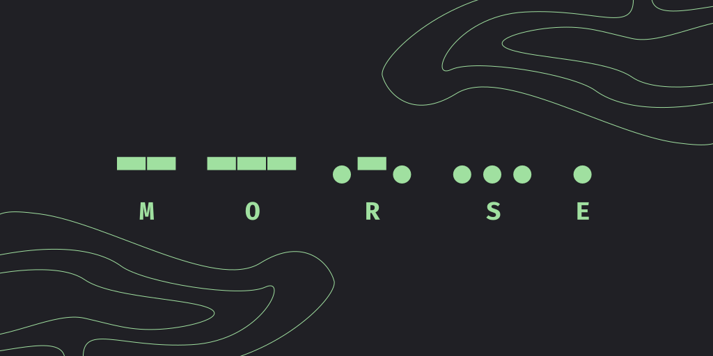

# Morse: Encoder and decoder


Morse is an encoder and decoder for [morse code](). The program is capable of encoding or decoding in either audio or text. In default, it uses the [international morse code]() but can be modified in the cheat sheet.

<p align="center"></p>

*"Morse" encoded in morse code.*

## Prerequisites

If you are running a Windows NT system, please use WSL (Windows Subsystem for Linux), and if you are using MacOS or (any) Linux (distro), you can continue the installation process.

- Rust programming language
- (Rust's) Cargo

## Installation (unstable)

Currently, there are no stable releases of Morse, cloning the repository directly will give you the in-development or unstable version.

1. Clone the repository via any option in the **<> Code** tab
2. Run the following command in the `Morse/` directory
```
cargo build
```
3. Morse would be compiled inside the `target/` directory

## Contributing

You can help the project by contributing to it via forking it. Instructions on how to fork it can be found [here](https://docs.github.com/en/get-started/quickstart/contributing-to-projects).

## License

Repository licensed under the [MIT](LICENSE) license.